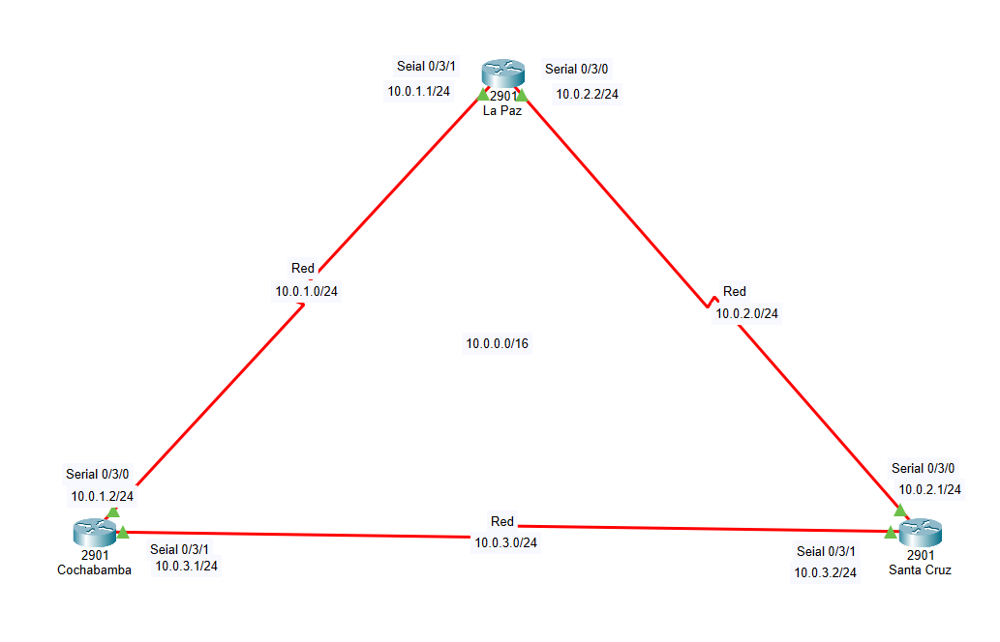
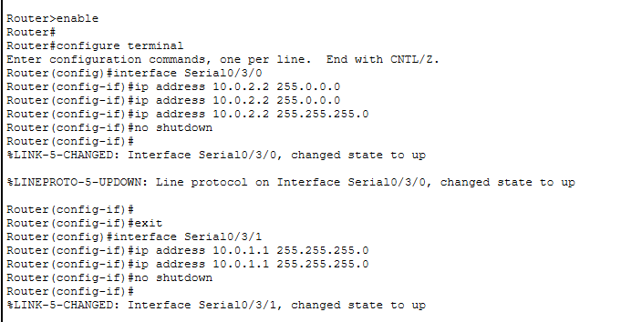
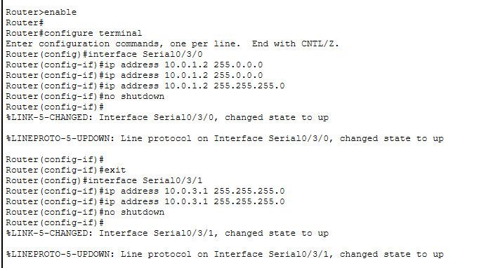
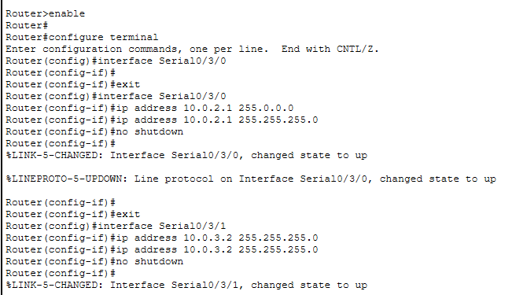
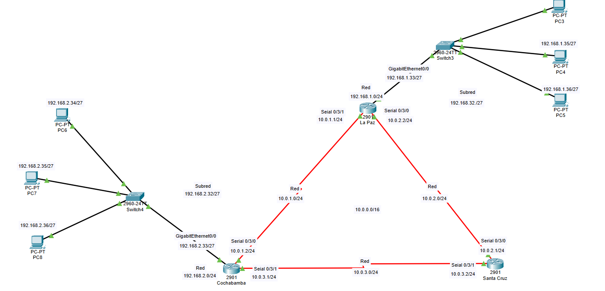
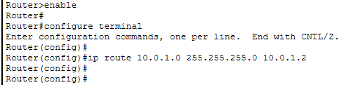
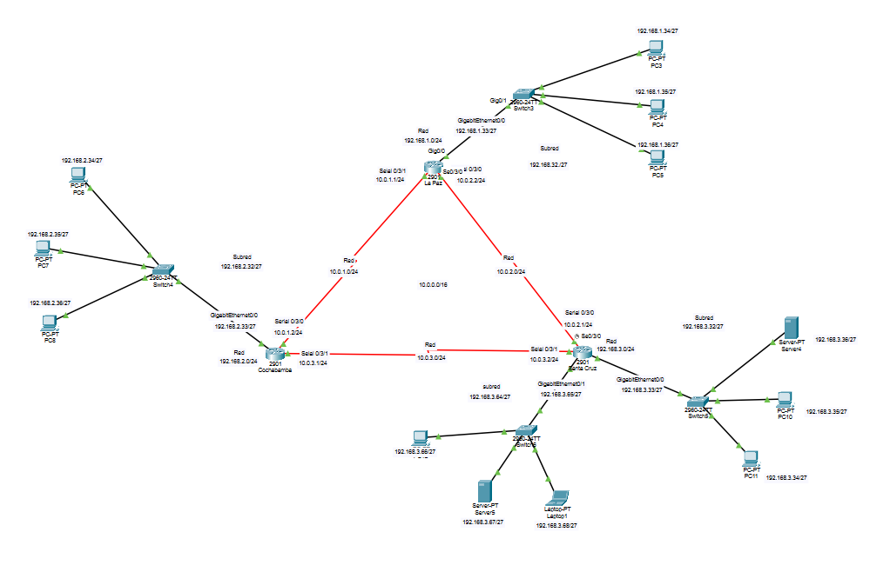

# Prototipo de cisco packet tracer

**Descripción:** Aqui se mostrará los pasos para hacer un prototipo de una conexión para una red que conecte 3 departamentos, que va a ser La Paz, Cochabamaba y Santa Cruz.

**Objetivo**
Conectar los tres departamentos (La Paz, Cochabamba y Santa Cruz) en una red privada que permita:

- Comunicación segura entre los departamentos.

- Envío de correos electrónicos y mensajes internos.

- Escalabilidad para futuras sucursales u oficinas.

## Paso 1: Conexión WAN entre Routers

### **Asignación de IPs y Subnetting**

**Rango de IPs**

**Rango principal:** 10.0.0.0/16.

**Bits adicionales:** 8 (para crear subredes más pequeñas).

**Nueva máscara de subred:** /24 (16 + 8 = 24).

### **Fórmulas Número de subredes**

**Número de subredes**

Número de subredes = 2^n, donde n es el número de bits prestados. 2^8 =256 subredes.

### **Número de hosts por subred**

Hosts por subred = 2 (32 − máscara)−2.

2^(32−24)− 2 = 256 − 2=254 hosts por subred.

###  **Tabla de Subredes**

| Subred | Dirección de red | Rango útil de IPs | Broadcast |
|---|---|---|---|
| 1 | 10.0.1.0/24 | 10.0.1.1 - 10.0.1.254 | 10.0.1.255 |
| 2 | 10.0.2.0/24 | 10.0.2.1 - 10.0.2.254 | 10.0.2.255 |
| 3 | 10.0.3.0/24 | 10.0.3.1 - 10.0.3.254 | 10.0.3.255 |
| ... | ... | ... | ... |
| 256 | 10.0.255.0/24 | 10.0.255.1 - 10.0.255.254 | 10.0.255.255 |

## Configuración de los Routers

### Topología de la Red WAN

* **Routers**: 3 (La Paz, Cochabamba, Santa Cruz).
* **Conexiones**:
    * La Paz ↔ Cochabamba
    * Cochabamba ↔ Santa Cruz
    * Santa Cruz ↔ La Paz



### Asignación de IPs y Conexiones


#### Router La Paz:

* Serial 0/3/0: 10.0.1.1/24 (conectado a Cochabamba).
* Serial 0/3/1: 10.0.3.2/24 (conectado a Santa Cruz).

#### Router Cochabamba:

* Serial 0/3/0: 10.0.1.2/24 (conectado a La Paz).
* Serial 0/3/1: 10.0.2.1/24 (conectado a Santa Cruz).

#### Router Santa Cruz:

* Serial 0/3/0: 10.0.2.2/24 (conectado a Cochabamba).
* Serial 0/3/1: 10.0.3.1/24 (conectado a La Paz).

#### Subredes WAN:

* Red 1: 10.0.1.0/24 (La Paz ↔ Cochabamba).
* Red 2: 10.0.2.0/24 (Cochabamba ↔ Santa Cruz).
* Red 3: 10.0.3.0/24 (Santa Cruz ↔ La Paz).

## Comandos de Configuración

### Router La Paz

```bash
interface Serial0/3/0
 ip address 10.0.1.1 255.255.255.0
 no shutdown

interface Serial0/3/1
 ip address 10.0.3.2 255.255.255.0
 no shutdown
 ```

 

### Router Cochabamba



### Router Santa Cruz



## Documentación de las Redes LAN

### 1. Asignación de IPs y Subnetting

* **Rango de IPs**
    * Rango principal: 192.168.0.0/24
* **División por departamento:**
    * La Paz: 192.168.1.0/24
    * Cochabamba: 192.168.2.0/24
    * Santa Cruz: 192.168.3.0/24

## Subnetting con 3 Bits

* **Bits prestados**: 3 (para crear 8 subredes).
* **Nueva máscara de subred**: /27 (24 + 3 = 27).
* **Hosts por subred**: 2<sup>(32-27)</sup> - 2 = 2<sup>5</sup> - 2 = 32 - 2 = 30 hosts por subred.

2<sup>(32-27)</sup> - 2 = 32 - 2 = 30 hosts por subred.

### Tabla de Subredes LAN

La Paz (192.168.1.0/24):

| Subred | Dirección de red | Rango útil de IPs | Broadcast |
|---|---|---|---|
| 1 | 192.168.1.0/27 | 192.168.1.1 - 192.168.1.30 | 192.168.1.31 |
| 2 | 192.168.1.32/27 | 192.168.1.33 - 192.168.1.62 | 192.168.1.63 |
| 3 | 192.168.1.64/27 | 192.168.1.65 - 192.168.1.94 | 192.168.1.95 |
| 4 | 192.168.1.96/27 | 192.168.1.97 - 192.168.1.126 | 192.168.1.127 |
| 5 | 192.168.1.128/27 | 192.168.1.129 - 192.168.1.158 | 192.168.1.159 |
| 6 | 192.168.1.160/27 | 192.168.1.161 - 192.168.1.190 | 192.168.1.191 |
| 7 | 192.168.1.192/27 | 192.168.1.193 - 192.168.1.222 | 192.168.1.223 |
| 8 | 192.168.1.224/27 | 192.168.1.225 - 192.168.1.254 | 192.168.1.255 |

**Cochabamba (192.168.2.0/24)**

| Subred | Dirección de red | Rango útil de IPs | Broadcast |
|---|---|---|---|
| 1 | 192.168.2.0/27 | 192.168.2.1 - 192.168.2.30 | 192.168.2.31 |
| 2 | 192.168.2.32/27 | 192.168.2.33 - 192.168.2.62 | 192.168.2.63 |
| 3 | 192.168.2.64/27 | 192.168.2.65 - 192.168.2.94 | 192.168.2.95 |
| 4 | 192.168.2.96/27 | 192.168.2.97 - 192.168.2.126 | 192.168.2.127 |
| 5 | 192.168.2.128/27 | 192.168.2.129 - 192.168.2.158 | 192.168.2.159 |
| 6 | 192.168.2.160/27 | 192.168.2.161 - 192.168.2.190 | 192.168.2.191 |
| 7 | 192.168.2.192/27 | 192.168.2.193 - 192.168.2.222 | 192.168.2.223 |
| 8 | 192.168.2.224/27 | 192.168.2.225 - 192.168.2.254 | 192.168.2.255 |

**Santa Cruz (192.168.3.0/24):**

| Subred | Dirección de red | Rango útil de IPs | Broadcast |
|---|---|---|---|
| 1 | 192.168.3.0/27 | 192.168.3.1 - 192.168.3.30 | 192.168.3.31 |
| 2 | 192.168.3.32/27 | 192.168.3.33 - 192.168.3.62 | 192.168.3.63 |
| 3 | 192.168.3.64/27 | 192.168.3.65 - 192.168.3.94 | 192.168.3.95 |
| 4 | 192.168.3.96/27 | 192.168.3.97 - 192.168.3.126 | 192.168.3.127 |
| 5 | 192.168.3.128/27 | 192.168.3.129 - 192.168.3.158 | 192.168.3.159 |
| 6 | 192.168.3.160/27 | 192.168.3.161 - 192.168.3.190 | 192.168.3.191 |
| 7 | 192.168.3.192/27 | 192.168.3.193 - 192.168.3.222 | 192.168.3.223 |
| 8 | 192.168.3.224/27 | 192.168.3.225 - 192.168.3.254 | 192.168.3.255 |



## Configuración de Rutas Estáticas

### Router de Cochabamba

```bash
ip route 192.168.1.0 255.255.255.0 10.0.1.1   # Ruta a La Paz
ip route 192.168.3.0 255.255.255.0 10.0.2.2   # Ruta a Santa Cruz
```

### Router de La Paz

```bash
ip route 192.168.2.0 255.255.255.0 10.0.1.2   # Ruta a Cochabamba
ip route 192.168.3.0 255.255.255.0 10.0.3.2   # Ruta a Santa Cruz
```

### Router de Santa Cruz

```bash
ip route 192.168.2.0 255.255.255.0 10.0.2.1   # Ruta a Cochabamba
ip route 192.168.1.0 255.255.255.0 10.0.3.1   # Ruta a La Paz
```






